# Mermaid 图表测试

> 用于验证 Markdown 预览的 Mermaid.js 集成是否正常工作

## 1. 流程图 (Flowchart)

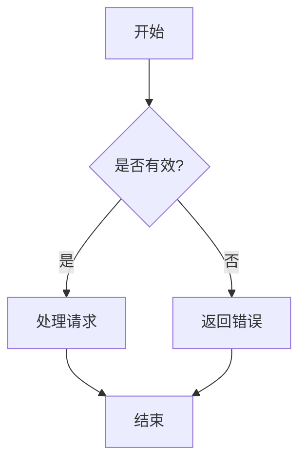

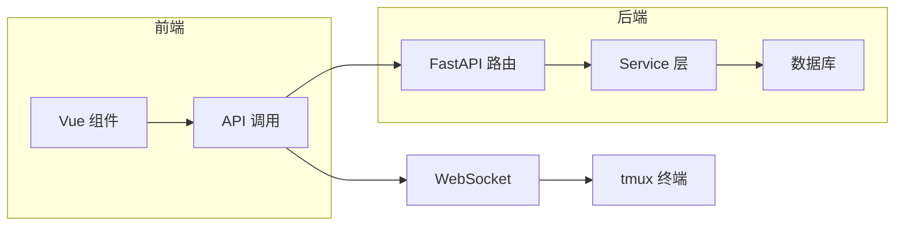

## 2. 时序图 (Sequence Diagram)

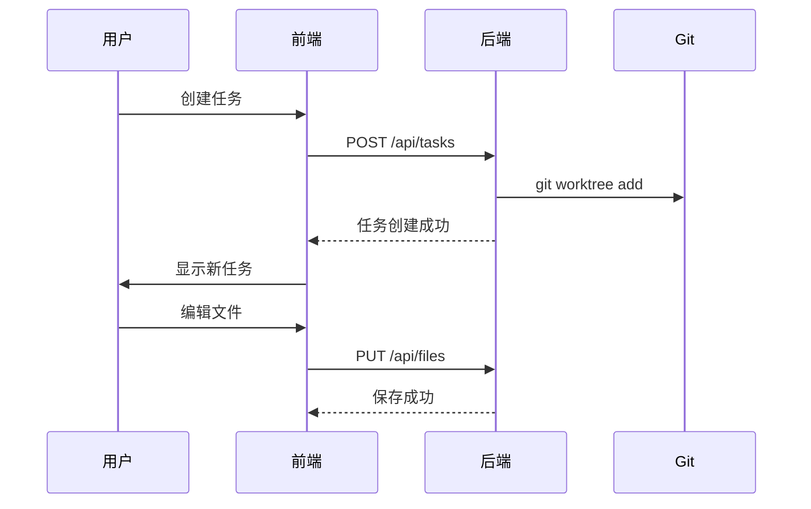

## 3. 类图 (Class Diagram)

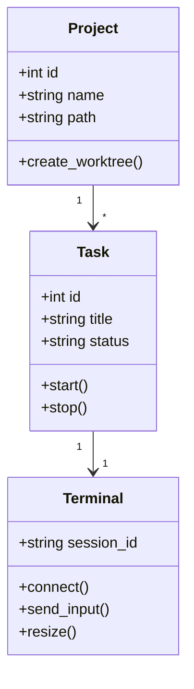

## 4. 状态图 (State Diagram)

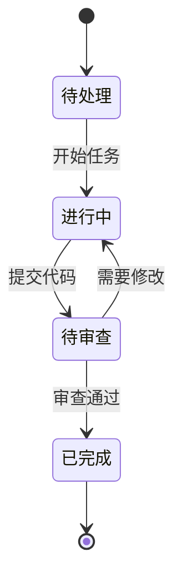

## 5. 饼图 (Pie Chart)

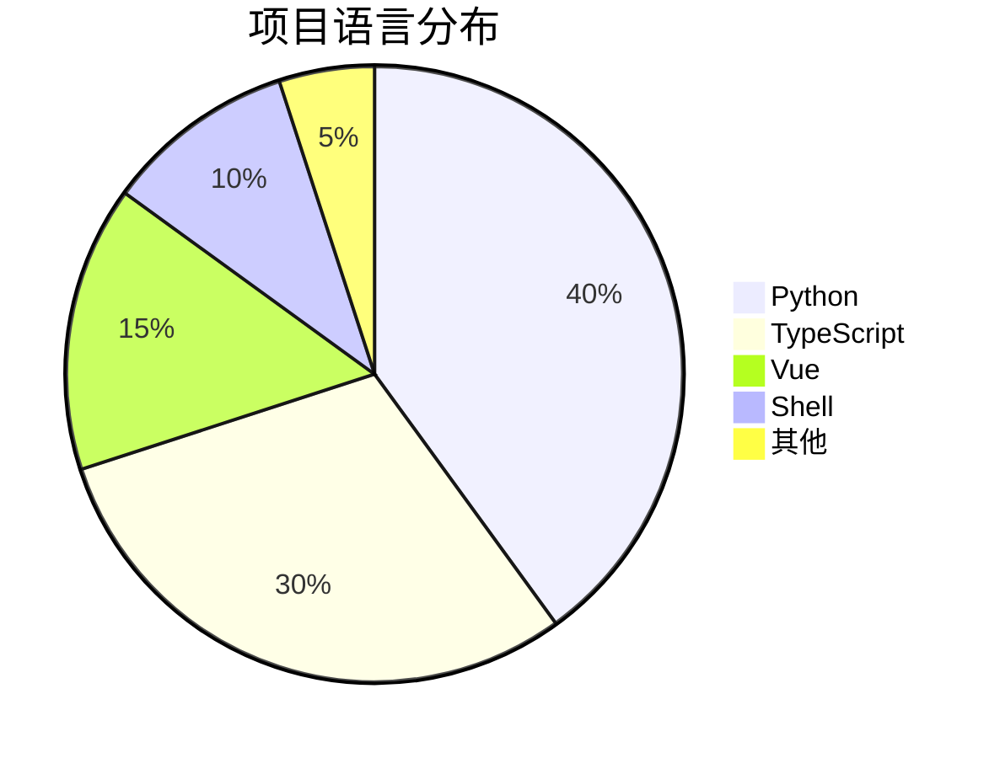

## 6. 甘特图 (Gantt Diagram)

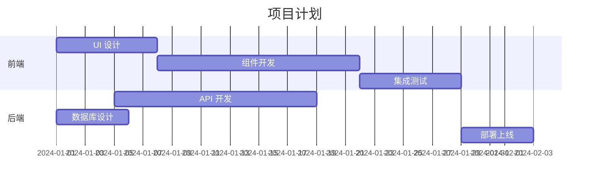

## 7. Git 分支图 (Gitgraph)

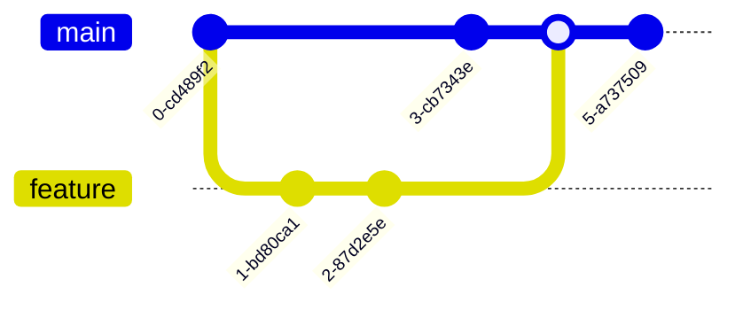

## 8. 实体关系图 (Entity Relationship)
## 8.1 子标题

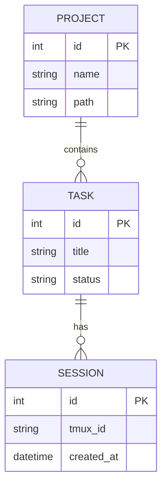

## 9. 用户旅程图 (User Journey)

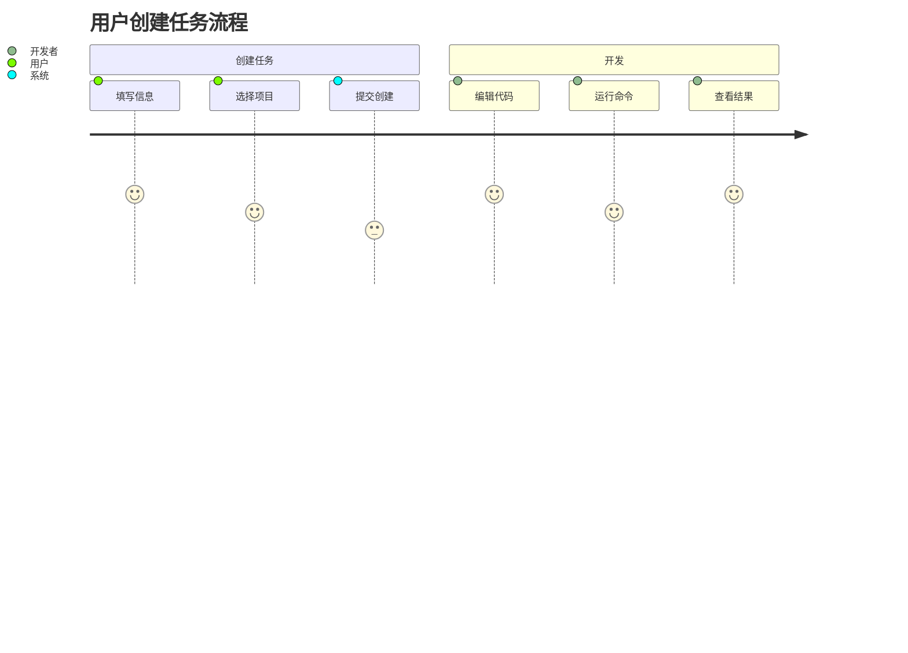

## 10. 思维导图 (Mindmap)

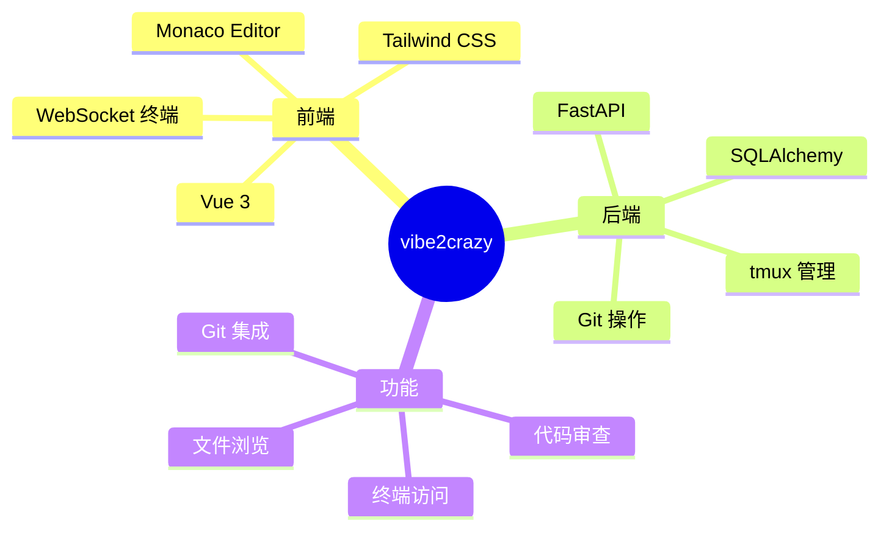

## 11. 复杂流程图 - 请求处理

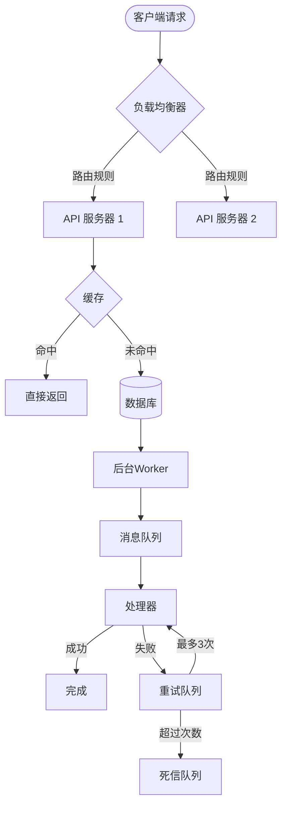

## 12. 象限图 (Quadrant Chart)

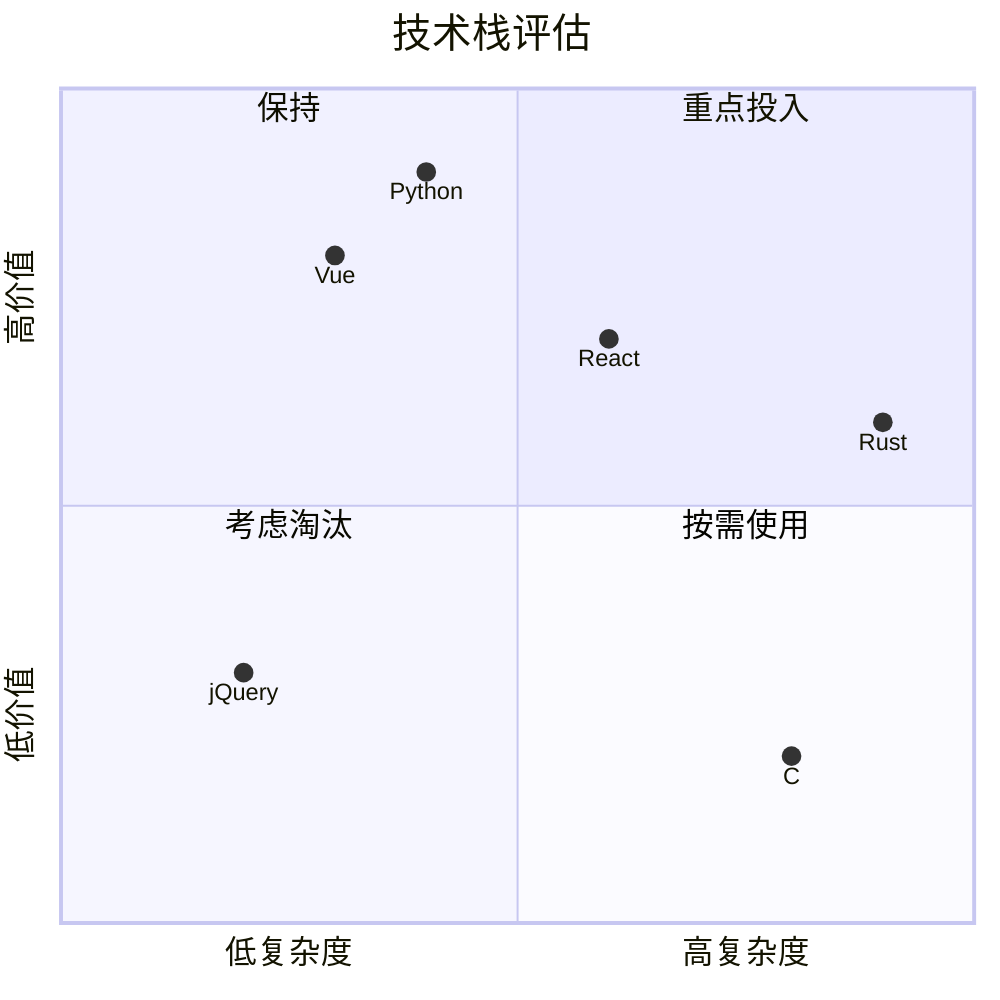

## 13. 时间线图 (Timeline)

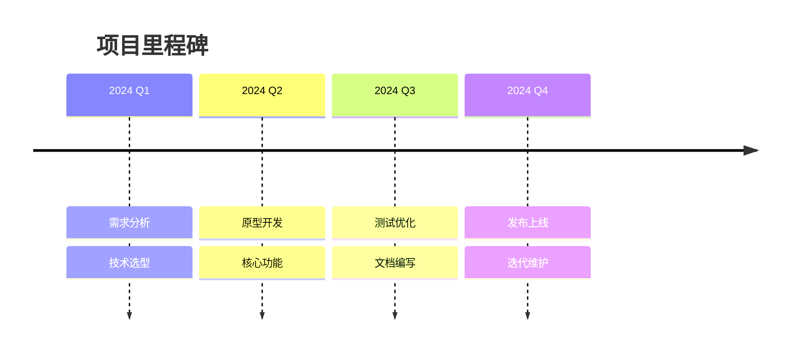

## 14. 架构图中的区块图 (Block Diagram)

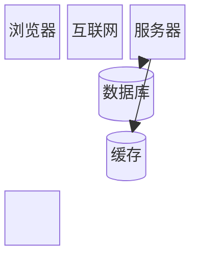

## 15. 普通代码块（应该不受影响）

```python
def hello():
    print("Hello, World!")
```

```javascript
const greet = (name) => {
    console.log(`Hello, ${name}!`);
};
```

---

> 以上包含了 Mermaid 支持的所有主流图表类型，用于验证 `MarkdownPreviewModal.vue` 中的 Mermaid.js 集成是否正确。
